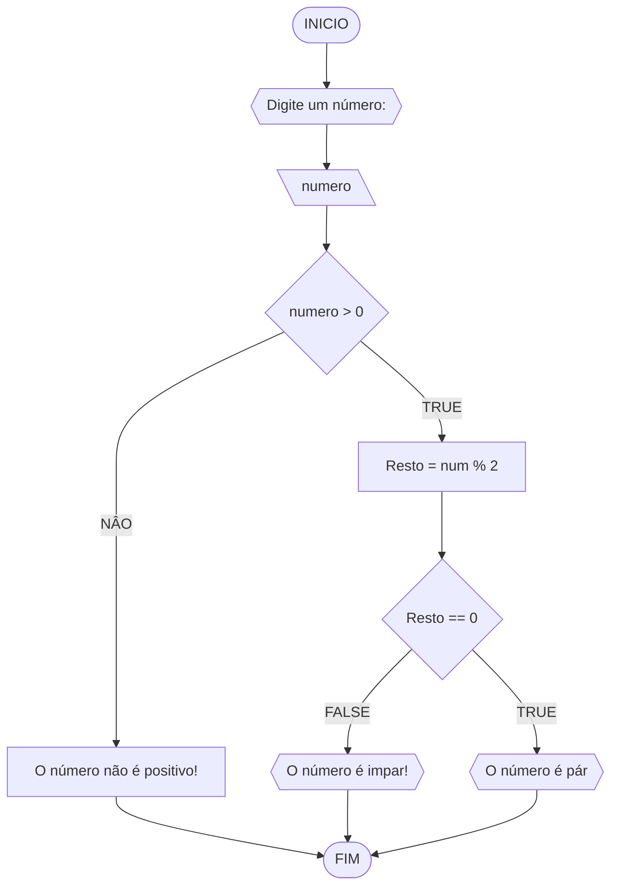

# Unifor
**Nome**: Thiago Maia Caccia <br>
**Disciplina**: Raciocínio Lógico e algorítimo

## Lista de exercícios 01

### Exercício 1
Respresente, em fluxo grama e pseudocódigo, um algorítimo para determinar se um número inteiro é positivo, par ou ímpar.

#### Fluxograma




#### Pseudocódigo
```


ALGORITIMO  Verifica_par_impar
DELCLARE num, resto: INTEIRO
INICIO
ESCREVA "Digite um número: "
LEIA num
SE num >= 0 ENTAO
	resto <- num % 2
	SE resto == 0 ENTAO 
		ESCREVA "O número é par!"
	SENAO
	    ESCREVA "O número é ímpar!"
    FIM_SE
SENAO
	ESCREVA " O número deve ser positivo!"
FIM_SE
FIM
```
#### Teste
| num | resto | num >= 0 | resto == 0 | Saída |
| -- | -- | -- | -- | -- |
| -1 | False |  |  | "O número deve ser positivo!" |
| 0 | True | 0 | True | "O número é par!" |
|10 | True | 1 | False | "O número é ímpar!" |

