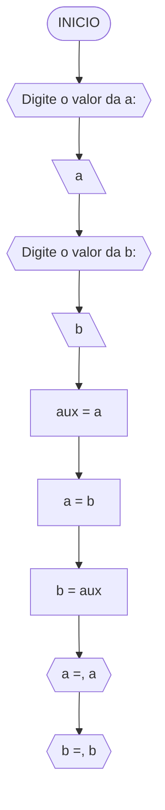
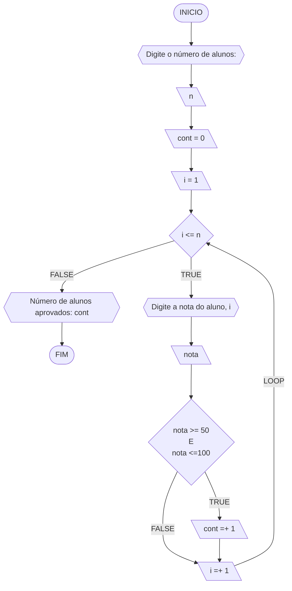
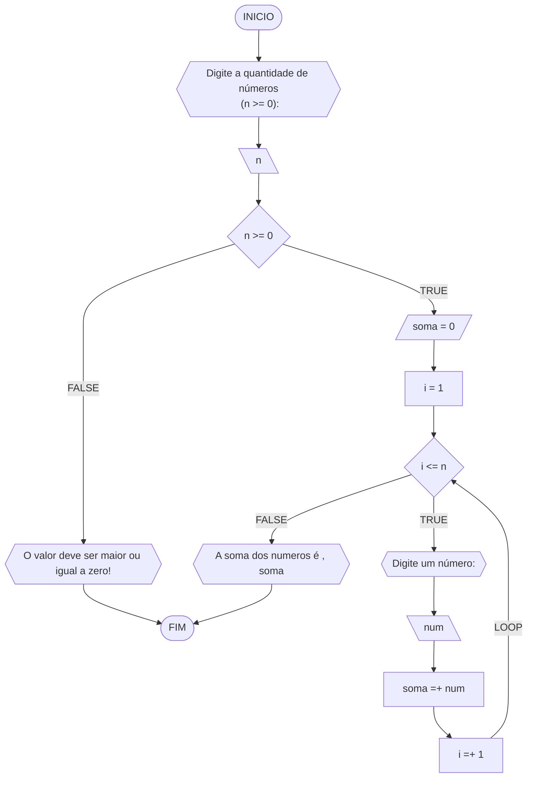
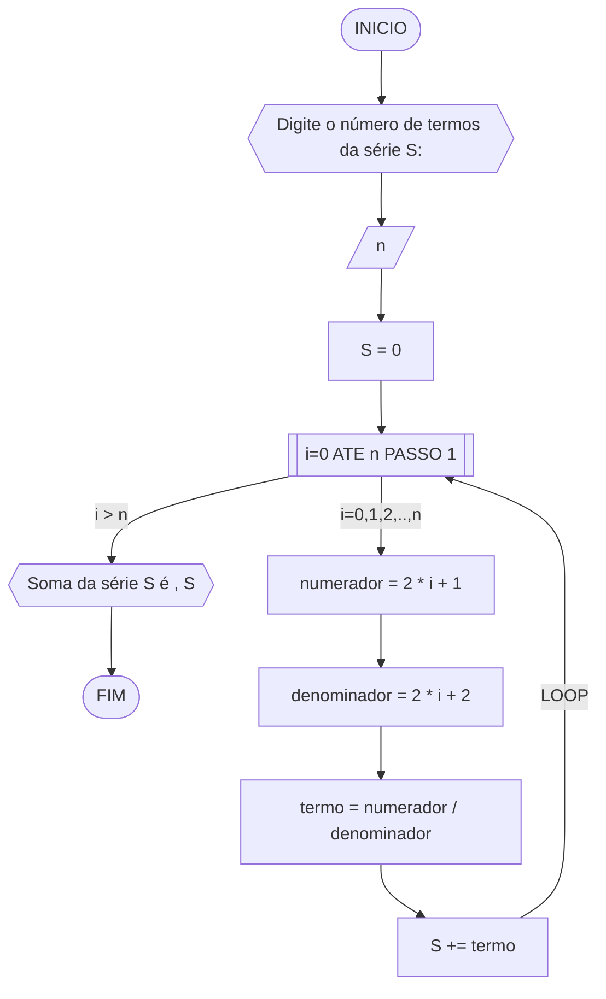
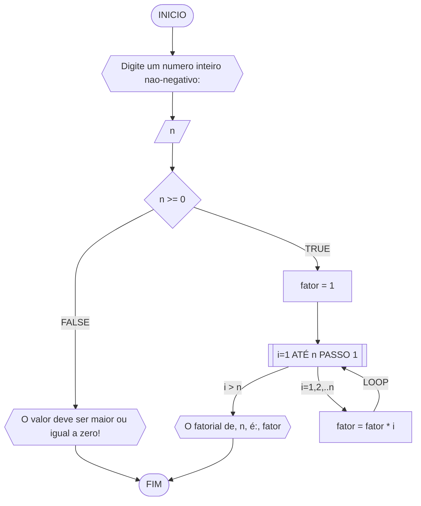
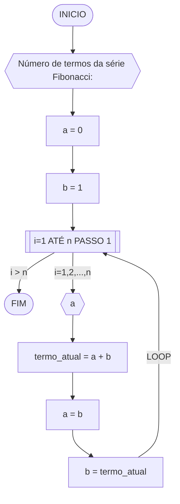
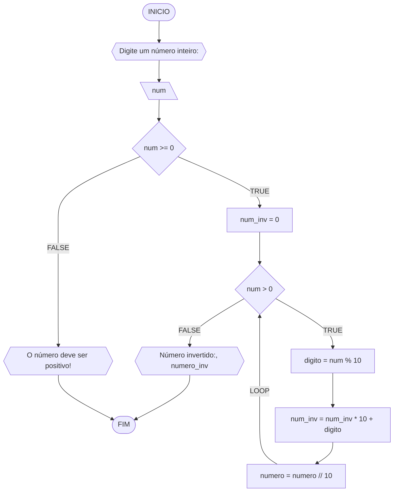

**Curso:** engenharia de computação <br>
**Disciplina:** raciocinio logico e algoritimo <br>
**Código/Turma:** 998-09 <br>
**Professor:** Ricardo Carubbi <br>
**Data:** 21/03/2024 <br>
**Aluno(a):** thiago maia caccia <br>
**Matrícula:** 2410325 <br>

**1a chamada (Sim/Não):** sim <br>
**2a chamada (Sim/Não):** nao

# Avaliação Diagnóstica 1

## Normas e exigências

Avaliação diagnóstica (**AD**) consiste em exercícios ou projetos desenvolvidos em grupo ao longo da disciplina. <br>
A primeira avaliação diagnóstica (**AD1**) será composta por exercícios e equivale a 30% da nota da primeira avaliação (**AV1**).

Segue abaixo a expressão para o cálculo da **AV1**, sendo sendo **AF1** equivale a primeira avaliação formativa e **AD1**, a primeira avaliação diagnóstica.

$$AV_1 = AF_1 \times 0,30 + AD_1 \times 0,70$$

A **AD1** é formada pela entrega dos exercícios (**EX1**) na data prevista e apresentação (**AP1**) de um dos exercícios escolhido pelo professor.
Segue abaixo a expressão para o cálculo da **AD1**.

$$AD_1 = (EX1_1 + AP_1)/2 $$

A **EX1** é avaliada mediante a **correção dos exercícios**, sendo a avaliação no intervalo de 0% (não atende a questão), 50% (atende parcialmente) e 100% (atende em sua totalidade).
Por exemplo, se o exercício equivale a 2 pontos e sua correção atente parcialmente a questão, então sua avaliação deste exercício será 1 ponto.

A **AP1** é avaliada mediante aos pré-requisitos de **clareza, organização e domínio do conteúdo**. Portanto, o aluno deve demonstrar um bom entendimento do algoritmo, explicando seus princípios fundamentais, seu propósito e como ele funciona passo a passo. <br>

A avaliação da **AP1** é apenas considerada no intervalo de 0% (não atende os pré-requisitos), 50% (atende parcialmente) e 100% (atende em sua totalidade).
Por exemplo, se na apresentação do exercício, o aluno atenter parcialmente os pré-requisitos, então sua avaliação da apresentação será 5,0.

## Datas
- Entrega da primeira avaliação formativa (**AF1**) composta pelas listas de exerciícios 1, 2 e 3: 21/03/24
- Entrega dos exercícios da primeira avaliação diagnóstica (**EX1**): 21/03/24
- Apresentação da primeira avaliação diagnóstica (**AP1**): 21/03/24

## Lista de questões

### Questão 1 - Troca dos valores de duas variáveis (1 ponto)

Dadas duas variáveis, $a$ e $b$, implemente e teste um algoritmo para trocar os valores atribuídos a elas.
#### Fluxograma (0.25 ponto)



#### Pseudocódigo (0.5 ponto)

```
ALGORITMO TrocarValores   //nome do algoritimo
1. DECLARE a, b, aux: INTEIRO     //declarei a, b e aux como elementos INTEIRO
2. INICIO   // inicio do algoritimo
3.   ESCREVA "Digite o valor da a: "   //solicitei para o usuario digitar o valor de a
4.   LEIA a     //solicitei para o programa ler o valor de a
5.   ESCREVA "Digite o valor da b: "   //solicitei para o usuario digitar o valor de b
6.   LEIA b     //solicitei para o programa ler o valor de b
7.   aux ← a    //atribui o valor de a para aux
8.   a ← b      //atribui o valor de b para a
9.   b ← aux    //atribui o valor de aux para b
10.  ESCREVA "a =", a   //escrevi o novo valor de a
11.  ESCREVA "b =", b   //escrevi o novo valor de b
12. FIM_ALGORITMO   //finalizei o algoritimo 


```

#### Teste de mesa (0.25 ponto)

| a  | b  | aux | a  | b  | saída 1 | saída 2 | 
| -- | -- | --  | -- | -- |  --     |   --    | 
| 0  | 1  | 0   | 1  | 0  | a = 1   | b = 0   |

### Questão 2 - Contagem (1 ponto)

Dado um conjunto $n$ de notas de alunos em um exame, implemente e teste um algoritmo para fazer uma contagem $cont$ do número de alunos que foram aprovados no exame. 
Será considerado aprovado o aluno que tirar $nota$ 50 ou maior (no intervalo de 0 a 100).

#### Fluxograma (0.25 ponto)

Fluxograma conforme descrição do algoritmo acima, usando o loop ENQUANTO.



#### Pseudocódigo (0.5 ponto)

```
Algoritmo ContaAprovacoes
1  ALGORITMO ContarAprovados    //titulo do algoritimo
2  DECLARE n, nota, cont, i: INTEIRO    //declarei os valores escritos como INTEIRO
3  INICIO    //dei inicio ao algoritimo
4    ESCREVA "Digite o número de alunos: "  //solicitei o n de alunos
5    LEIA n  //solicitei a leitura do valor n
6    cont ← 0  //declari cont como 0
7    i ← 1   //declarei i como 1
8    ENQUANTO i <= n FAÇA  //dei inicio a ferramenta ENQUANTO
9      ESCREVA "Digite a nota do aluno ", i, ": "  //solicitei que o usuario digitar a nota
10     LEIA nota   //solicitei a leitura da variavel
11     SE nota >= 50 E nota <= 100 ENTÃO  //inicio da ferramenta SE
12       cont ← cont + 1 //atribui um novo valor a cont
13     FIM_SE  //finalizei a ferramenta SE
14     i ← i + 1  // atribui um novo valor a i
15   FIM_ENQUANTO  /finalizei a ferramenta ENQUANTO
16   ESCREVA "Número de alunos aprovados: ", cont  /solicitei que o algoritimo escreva o numero de aprovados (cont)
17 FIM_ALGORITMO    //fim do algoritimo


```

#### Teste de mesa (0.25 ponto)
Teste de mesa referente ao algoritmo usando o loop ENQUANTO.

| it | n  | i  | cont | i<=n  | nota, i | nota | nota_valida | cont+1 | i+1 | saída        | 
| -- | -- | -- | --   | --    | --      | --   | --          | --     | --  | --           |
| 1  | 3  | 1  |  0   | True  | nota 1  | 60   | True        | 1      | 2   | Aprovados: 1 |
| 2  | 3  | 2  |  1   | True  | nota 2  | 40   | False       | 1      | 3   | Aprovados: 0 |
| 3  | 3  | 3  |  1   | True  | nota 3  | 90   | True        | 2      | 4   | Aprovados: 1 |
| 4  | 3  | 4  |  2   | False | nota 4  | 80   | True        | 3      | 5   | Aprovados: 2 |


### Questão 3 - Soma de um conjunto de números (1 ponto)

Dado um conjunto de $n$ números, implemente e teste um algoritmo para calcular a soma desses números. <br>
Aceite apenas $n$ maior ou igual a zero.

#### Fluxograma (0.25 ponto)



#### Pseudocódigo (0.5 ponto)

```

ALGORITMO CalcularSoma
1. DECLARE n, soma, i, num: INTEIRO   //declarei as variaveis como INTEIRO
2. INICIO   //inicio do algoritimo
3.   ESCREVA "Digite a quantidade de números (n >= 0): "   //solicitei que o usuario digite o valor de n
4.   LEIA n   //solicitei a leitura da entrada do usuario (valor de n)
5.   SE n < 0 ENTÃO   //inicio da ferramenta SE
6.     ESCREVA "O valor deve ser maior ou igual a zero!"   //solicitei que escreva a seguinte frase
7.   SENÃO    //inicio da ferramenta SENAO
8.     soma ← 0   //atribui um valor a soma
9.     i ← 1     //atribui um valor a i
10.    ENQUANTO i <= n FAÇA    //inicio da ferramenta ENQUANTO
11.      ESCREVA "Digite um número: "   //solicitei a entrada de num
12.      LEIA num    //solicitei a leitura de num
13.      soma ← soma + num   //atribui um novo valor a soma
14.      i ← i + 1    //atribui um novo valor a i
15.    FIM_ENQUANTO     //fim da ferraenta ENQUANTO
16.    ESCREVA "A soma dos números é ", soma    //solicitei que escreva o valor da soma
17.   FIM_SE   //fim da ferramenta SE
18. FIM_ALGORITMO  //fim do algoritimo 


```

#### Teste de mesa (0.25 ponto)

| it | n  | n >= 0 | soma | i  | i <= n | num | soma =+ num  | saída                   |
| -- | -- | --     | --   | -- | --     | --  | --           | --                      |
|    | -3 | False  |      |    |        |     |              | O valor deve ser ...    |
| 1  | 0  | True   | 0    | 1  | False  |     |              | A soma dos números é 0  |
| 1  | 3  | True   | 0    | 1  | True   | 5   | 0 + 5 = 5    | A soma dos números é 5  |
| 2  | 3  | True   | 5    | 2  | True   | 10  | 5 + 10 = 15  | A soma dos números é 15 |
| 3  | 3  | True   | 15   | 3  | True   | 20  | 15 + 20 = 35 | A soma dos números é 35 |
| 4  | 3  | True   | 35   | 4  | False  | 0   | 35 + 0 = 35  | A soma dos números é 35 |


### Questão 4 - Cálculo de uma série (1 ponto)

Dado um conjunto de $n$ termos da série, implemente e teste um algoritmo para calcular o valor de S, conforme definido abaixo:

$$ S = \frac{1}{2} + \frac{3}{4} + \frac{5}{6} + \frac{7}{8} + \dots $$

#### Fluxograma (0.25 ponto)



#### Pseudocódigo (0.5 ponto)

```
ALGORITMO CalcularSerieS   //titulo do algoritimo
1. DECLARE n, S, numerador, denominador, termo, i: INTEIRO   //declarei os seguintes elementos como INTEIRO
2. INICIO    //inicio do algoritio
3.   ESCREVA "Digite o número de termos da série S: "   //solicitei a entrada do valor de s
4.   LEIA n   //solicitei a leitura da entrada do usuario (valor de n)
5.   S ← 0   //atribui um valor a S 
6.   PARA i DE 0 ATÉ n PASSO 1 FAÇA    //inicio da ferramenta PARA
7.     numerador ← 2 * i + 1   //atribui a seguinte equacao como valor do numerador
8.     denominador ← 2 * i + 2    //atribui a seguinte equacao como valor do denominador
9.     termo ← numerador / denominador   //atribui a seguinte equacao como valor do termo
10.    S ← S + termo    //atribui a seguinte soma como novo valor de S
11.  FIM_PARA   /fim da ferramenta PARA
12.  ESCREVA "Soma da série S é ", S   //solicitei que escreva o valor de S
13. FIM_ALGORITMO    //fim do algoritimo
```

#### Teste de mesa (0.25 ponto)

| it | n  | S  | i | numerador | denominador | termo | S += termo     | saída                  |
| -- | -- | -- |-- | --        | --          | --    | --             | --                     |
|    | 0  | 0  |   |           |             |       |                |                        |
| 1  | 4  | 0  | 0 | 2*0+1 = 1 | 2*0+2 = 2   | 1/2   | 0+1/2 = 1/2    | Soma da série S é 1/2  |
| 2  | 4  | 0  | 1 | 2*1+1 = 1 | 2*1+2 = 2   | 3/4   | 1/2+3/4 = 1.25 | Soma da série S é 1.25 |
| 3  | 4  | 0  | 2 | 2*2+1 = 1 | 2*2+2 = 2   | 5/6   | 0+1/2 = 2.08   | Soma da série S é 2.08 |
| 4  | 4  | 0  | 3 | 2*3+1 = 1 | 2*3+2 = 2   | 7/8   | 0+1/2 = 2.96   | Soma da série S é 2.96 |

### Questão 5 - Cálculo fatorial (2 pontos)

Dado um número $n$, implemente e teste um algoritmo para calcular o fatorial de $n$ (escrito como $n!$), onde $n ≥ 0$.

#### Fluxograma (0.5 ponto)



#### Pseudocódigo (1.0 ponto)

```
ALGORITMO CalcularFatorial     //titulo do algoritimo
1. DECLARE n, fator, i: INTEIRO    //declarei ps seguintes elementos como INTEIRO
2. INICIO   //incio do algoritimo
3.   ESCREVA "Digite um número inteiro não-negativo:"   //solicitei a entrada do valor de n
4.   LEIA n   //solicitei e leitura do valor de n
5.   SE n >= 0 ENTÃO   //inicio da ferramenta SE
6.     fator ← 1   //atribui um valor a fator
7.     PARA i DE 1 ATÉ n PASSO 1 FAÇA   //incio da ferramenta PARA
8.       fator ← fator * i   //atribui a seguinte equação como novo valor para fator
9.     FIM_PARA    //fim da ferramenta PARA
10.    ESCREVA "O fatorial de ", n, " é: ", fator   //solicitei que escreva o valor de  e de fator
11.  SENÃO   //incio da ferramenta SENAO
12.    ESCREVA "O valor deve ser maior ou igual a zero!"   //solicitei que escreva a seguinte frase
13.  FIM_SE   //fim da ferramenta SE
14. FIM_ALGORITMO  //fim do algoritimo

```

#### Teste de mesa (0.5 ponto)

| n  | fator | i  | fator = fator * i | saída               |
| -- | --    | -- | --                | --                  |
| 3  | 1     | 1  | 1*1 = 1           | O fatorial de 1 é 1 |
| 3  | 1     | 2  | 1*2 = 2           | O fatorial de 2 é 2 |
| 3  | 2     | 3  | 2*3 = 6           | O fatorial de 3 é 6 |
### Questão 6 - Geração da sequência de Fibonacci (2 pontos)

Gerar e imprimir os $n$ primeiros termos da sequência de Fibonacci, onde $n ≥ 1$. <br>
Os primeiros termos são: $0, 1, 1, 2, 3, 5, 8, 13, \dots$ <br>
Cada termo, além dos dois primeiros, é derivado da soma dos seus dois antecessores mais próximos.

#### Fluxograma (0.5 ponto)



#### Pseudocódigo (1.0 ponto)

```
ALGORITMO SerieFibonacci    //titulo do algoritimo
1. DECLARE n, a, b, termo_atual, i: INTEIRO   //declarei os seguintes elementos como INTEIRO
2. INICIO  //inicio do algoritimo
3.   ESCREVA "Número de termos da série Fibonacci: "  //solicitei a entrada do valor de n
4.   LEIA n  //solicitei a leitura de n
5.   a ← 0   //atribui um valor a "a"
6.   b ← 1   //atribui um valor a "b"
7.   PARA i DE 1 ATÉ n PASSO 1 FAÇA   //inicio da ferramenta PARA
8.     ESCREVA a   //solicitei que escreva o seguinte elemento
9.     termo_atual ← a + b  //atribui a seguinte equacao para o elemento "termo_atual"
10.    a ← b    //atribui um valor para a
11.    b ← termo_atual   //atribui o seguite valor para b
12. FIM_PARA   //fim da ferramenta PARA
13. ESCREVA "FIM"   //solicitei que escreva FIM
14. FIM_ALGORITMO    //fim do algoritimo


```
#### Teste de mesa (0.5 ponto)

| it | n  | a  | b  | i  | saída | termo_atual = a + b | a = b | b = termo_atual |
| -- | -- | -- | -- | -- | --    | --                  | --    | --              |
| 1  | 5  | 0  | 1  | 1  | 0     | 0 + 1 = 1           | 1     | 1               |
| 2  | 5  | 1  | 1  | 2  | 1     | 1 + 1 = 2           | 1     | 2               |
| 3  | 5  | 1  | 2  | 3  | 1     | 1 + 2 = 3           | 2     | 3               |
| 4  | 5  | 2  | 3  | 4  | 2     | 2 + 3 = 5           | 3     | 5               |
| 4  | 5  | 3  | 5  | 5  | 3     | 3 + 5 = 8           | 5     | 8               |


### Questão 7 - Inversão dos dígitos de um número inteiro (2 pontos)

Implemente e teste um algoritmo para inverter a ordem dos dígitos de um número inteiro positivo de dois dígitos.

#### Fluxograma (0.5 ponto)



#### Pseudocódigo (1.0 ponto)

```
ALGORITMO InverterNumero   //titulo do algoritimo
1. DECLARE num, num_inv, digito: INTEIRO    //declarei os seguites elementos como INTEIRO
2. INICIO   //inicio do algoritimo
3.   ESCREVA "Digite um número inteiro: "   //solicitei a entrada do valor de num
4.   LEIA num    //solicitei a leitura do valor de num
5.   SE num >= 0 ENTÃO    //inicio da ferramenta SE
6.     num_inv ← 0   //atribui um valor para "num_inv"
7.     SE num > 0 ENTÃO   //incio ferramenta SE 
8.       ENQUANTO num > 0 FAÇA   //incio ferramenta ENQUANTO
9.         digito ← num % 10  //atribui valor para o elemento
10.        num_inv ← num_inv * 10 + digito    //atribui um novo valor para o elemento
11.        num ← num // 10   //atribui valor para o elemento
12.      FIM_ENQUANTO    //fim ferramenta ENQUANTO
13.    SENÃO    //inicio da ferramenta SENAO
14.      ESCREVA "O número deve ser positivo!"    //solicitei que escreva a segunte frase
15.    FIM_SE   //fim da ferramenta SE
16.    ESCREVA "Número invertido:", num_inv    //solicitei que escreva o valor do seguinte elemento
17.  SENÃO    //inicio da ferramenta SENAO
18.    ESCREVA "O número deve ser não-negativo!"   //solicitei a escritura da seguinte frase
19.  FIM_SE    //fim da ferramenta SE
20. FIM_ALGORITMO   //fim do algoritimo

```

#### Teste de mesa (0.5 ponto)

| it | num | num_inv | num > 0 | digito | num = num // 10 | num_inv = (num_inv * 10) + digito | Saída                       |
| -- | --  | --      | --     | --      | --              | --                                | --                          |
|    | -1  | 0       | False  |         |                 |                                   | O número deve ser positivo! |
| 1  | 0   | 0       | False  |         |                 |                                   | Número invertido:: 0        |
| 1  | 42  | 0       | True   | 2       | 4               | 2                                 |                             |
| 2  | 4   | 2       | True   | 4       | 0               | 24                                |                             |
| 3  | 0   | 24      | False  |         |                 |                                   | Número invertido:: 24       |
