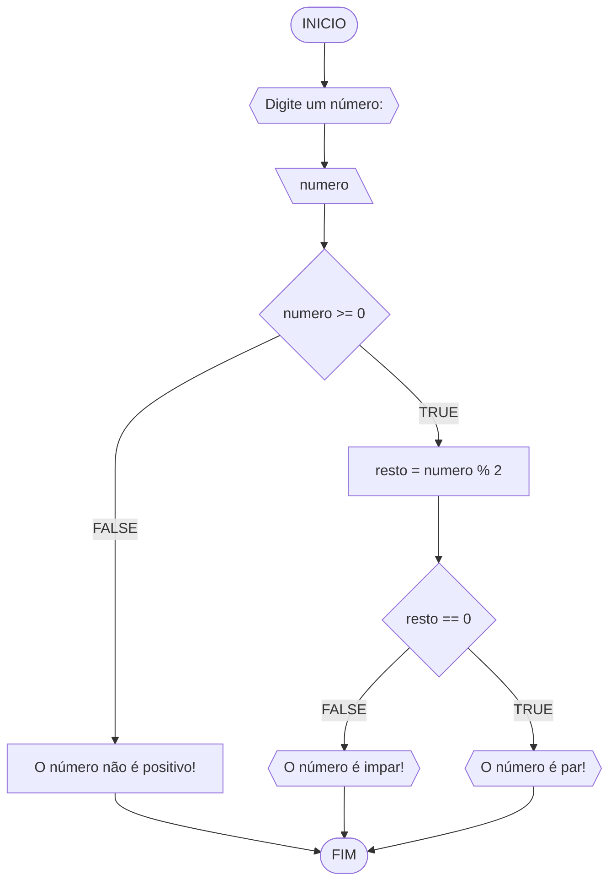
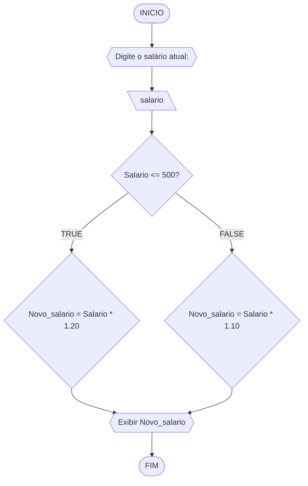
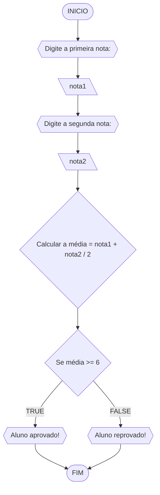
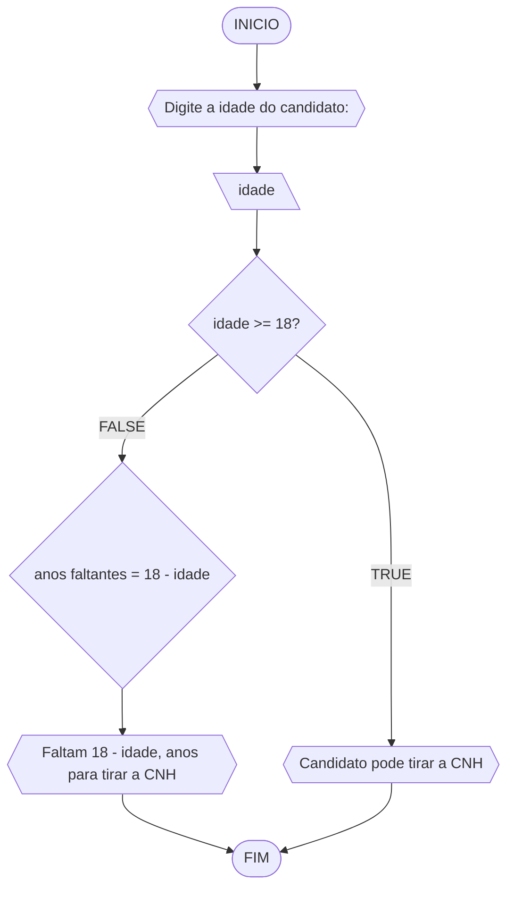

# UNIFOR
**Nome**: Nome do estudante <br>
**Disciplina**: Raciocínio lógico algorítmico

## Lista de exercícios 01

### Exercício 01 (1 ponto)
Represente, em fluxograma e pseudocódigo, um algoritmo para determinar se um número inteiro e positivo é par ou impar.

#### Fluxograma (0,25 ponto)



#### Pseudocódigo (0,5 ponto)
```
1  ALGORTIMO verifica_par_impar
2  DECLARE numero, resto: INTEIRO
3  ESCREVA "Digite um número: "
4  INICIO
4  LEIA numero
5  SE numero >= 0 ENTAO                  // verifica se o inteiro é positivo
6    resto = numero % 2                 // calcula o resto da divisão por 2
7    SE resto == 0 ENTAO                // verifica se o resto é igual a zero
8      ESCREVA "O número é par!"
9    SENAO
10     ESCREVA "O número é impar!"
11   FIM_SE
11  SENAO                                // caso inteiro for negativo (condição linha 5)
12    ESCREVA "O número deve ser postivo!"
13  FIM_SE
13 FIM
```

#### Teste de mesa (0,25 ponto)
| numero | numero >= 0 | resto | resto == 0 | Saída |
| -- | -- | -- | -- | -- | 
| -1 | F |   |   | "O número deve ser postivo!" |
| 0  | V | 0 | V | "O número é par!" |
| 13 | V | 1 | F | "O número é impar!" |
| 30 | V | 0 | V | "O número é par!" |

## Exercício 02 (3 pontos)
Represente, em fluxograma e pseudocódigo, um algoritmo para calcular o novo salário de um funcionário. 
Sabe-se que os funcionários que recebem atualmente salário de até R$ 500 terão aumento de 20%; os demais terão aumento de 10%.

#### Fluxograma (1.0 ponto)



#### Pseudocódigo (1.0 ponto)

```
ALGORITMO CalcularNovoSalario
1. DECLARE salario, novo_salario: REAL
2. INICIO
3.   ESCREVA "Digite o salário atual: "
4.   LEIA salario
5.   SE salario <= 500 ENTÃO
6.     novo_salario <- salario * 1.20
7.   SENÃO
8.     novo_salario <- salario * 1.10
9.   FIM_SE
10.  ESCREVA "O novo salário é: ", novo_salario
11. FIM_ALGORITMO

```

#### Teste de mesa (1.0 ponto)

| it |	salario |	salario <= 500 |	novo_salario |
| 1	 |    400	  |  VERDADEIRO	   |      480      |
| 2	 |    800	  |     FALSO	     |      880      |
| 3  |    500   |  VERDADEIRO    |      600      |
## Exercício 03 (3 pontos)
Represente, em fluxograma e pseudocódigo, um algoritmo para calcular a média aritmética entre duas notas de um aluno e mostrar sua situação, que pode ser aprovado ou reprovado.

#### Fluxograma (1 ponto)



#### Pseudocódigo (1 ponto)

```
ALGORITMO CalcularMediaEStatus
1. INÍCIO
2.     ESCREVA "Digite a primeira nota: "
3.     LEIA nota1
4.     ESCREVA "Digite a segunda nota: "
5.     LEIA nota2
6.     media <- (nota1 + nota2) / 2
7.     SE media >= 6 ENTÃO
8.         ESCREVA "Aluno aprovado!"
9.     SENÃO
10.        ESCREVA "Aluno reprovado!"
11.    FIM_SE
12. FIM_ALGORITMO

```

#### Teste de mesa (1 ponto)

| it |	nota1 |	nota2 |	media | situacao  |
| 1	 |   7.5	|  8.0	| 7.75	| Aprovado  |
| 2	 |   6.0	|  5.5	| 5.75	| Reprovado |
| 3	 |   4.0	|  6.0	| 5.0	  | Reprovado |

## Exercício 04 (3 pontos)
Represente, em fluxograma e pseudocódigo, um algoritmo que, a partir da idade do candidato(a), determinar se pode ou não tirar a CNH. 
Caso não atender a restrição de idade, calcular quantos anos faltam para o candidato estar apto.

#### Fluxograma (1.0 ponto)



#### Pseudocódigo (1.0 ponto)

```
1  ALGORITMO VerificarCNH
2      DECLARE idade, anos_faltantes: INTEIRO
3      
4      ESCREVA "Digite a idade do candidato: "
5      LEIA idade
6      
7      SE idade >= 18 ENTÃO
8          ESCREVA "Candidato pode tirar a CNH"
9      SENÃO
10         anos_faltantes <- 18 - idade
11         ESCREVA "Faltam ", anos_faltantes, " anos para tirar a CNH"
12     FIM_SE
13     
14     ESCREVA "FIM"
15 FIM_ALGORITMO

```

#### Teste de mesa (1.0 ponto)

| it |	idade | anos_faltantes |	Mensagem                       |
| 1	 |   20	  |      -         |	Candidato pode tirar a CNH     |
| 2	 |   16	  |      2	       |  Faltam 2 anos para tirar a CNH |
| 3	 |   18	  |      -         |	Candidato pode tirar a CNH     |
