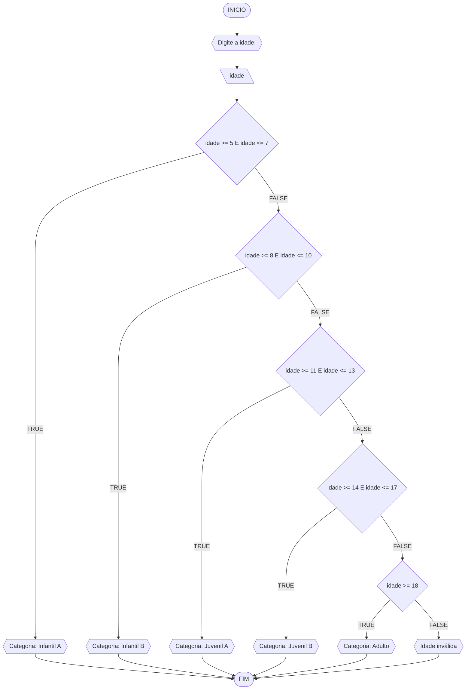

# UNIFOR
**Nome**: Nome do estudante <br>
**Disciplina**: Raciocínio lógico algorítm

## Exercício exemplo
Represente, em fluxograma e pseudocódigo, um algoritmo para calcular o adicional de salário de funcionário por cargo de uma empresa fictícia. Sabe-se que os funcionários de cargo técnico receberão reajuste de 50%, cargo de gerência, um reajuste de 30% e demais, um reajuste de 10%. 

#### Fluxograma


#### Pseudocódigo
```
1  ALGORITMO calReajuste
2  DECLARE  sal, sal_reaj: real, prof: caractere
3  INICIO
4  LEIA sal, prof
5  ESCOLHA
6   CASO prof == “Técnico”		// caso 1
7     sal_reaj ← 1.5 * sal
8   CASO prof = “Gerente”		// caso 2
9     sal_reaj ← 1.3 * sal
10  SENÃO
11    sal_reaj ← 1.1 * sal
12 FIM_ESCOLHA
13 ESCREVA “Salário Reajustado = “, sal_reaj
14 FIM
```

#### Teste
| sal | prof | prof == “Técnico” | prof = “Gerente” | sal_reaj | Saída |
| -- | -- | -- | -- | -- | -- |
| 1000 | Técnico | V | F | 1500 | “Salário Reajustado = 1500“ |
| 2000 | Gerente | F | V | 2600 | “Salário Reajustado = 2600“ |
| 9000 | Diretor | F | F | 9900 | “Salário Reajustado = 9900“ |

## Lista de exercícios 02

### Exercício 01 (2.5 pontos)
Calcule a média de quatro números inteiros dados.

#### Fluxograma (1.0 ponto)


#### Pseudocódigo (1.0 ponto)

```
1  ALGORITMO calcularMedia
2  DECLARE num1, num2, num3, num4, media: INTEIRO
3  INICIO
4    ESCREVA "Digite o primeiro número: "
5    LEIA num1
6    ESCREVA "Digite o segundo número: "
7    LEIA num2
8    ESCREVA "Digite o terceiro número: "
9    LEIA num3
10   ESCREVA "Digite o quarto número: "
11   LEIA num4
12   media ← (num1 + num2 + num3 + num4) / 4
13   ESCREVA "A média dos quatro números é: ", media
14 FIM_ALGORITMO

```

#### Teste de mesa (0.5 ponto)

| it |	num1 | num2 |	num3 |	num4 |	media |
| 1  |	 10  |  20  |	 30  |   40  |   25   |
| 2  |   5   |  5	  |  5	 |   5	 |   5    |
| 3  |  -10  | -20	| -30	 |  -40	 |  -25   |
### Exercício 02 (2.5 pontos)
Leia uma temperatura dada em Celsius (C) e imprima o equivalente em Fahrenheit (F). (Fórmula de conversão: F = (9/5) * C + 32)

#### Fluxograma (1.0 ponto)


#### Pseudocódigo (1.0 ponto)

```
1  ALGORITMO ConversorCelsiusToFahrenheit
2      DECLARE C, F: REAL
3      INICIO
4          ESCREVA "Digite a temperatura em Celsius (C): "
5          LEIA C
6          F <- (9/5) * C + 32
7          ESCREVA "A temperatura em Fahrenheit é: ", F
8      FIM_ALGORITMO

```

#### Teste de mesa (0.5 ponto)
| it |	C	 | F   |
| 1	 |  0	 | 32  |
| 2	 | 100 | 212 |
| 3	 | -40 | -40 |

### Exercício 03 (2.5 pontos)
Receba dois números reais e um operador e efetue a operação correspondente com os valores recebidos (operandos). 
O algoritmo deve retornar o resultado da operação selecionada simulando todas as operações de uma calculadora simples.

#### Fluxograma (1.0 ponto)


#### Pseudocódigo (1.0 ponto)

```
1. ALGORITMO Calculadora
2. DECLARE num1, num2, resultado: REAL
3. INÍCIO
4.    ESCREVA "Digite o primeiro número:"
5.    LEIA num1
6.    ESCREVA "Digite o segundo número:"
7.    LEIA num2
8.    ESCREVA "Digite o operador (+, -, *, /):"
9.    LEIA operador
10.    SE operador == '+' ENTÃO
11.        resultado ← num1 + num2
12.    SENÃO SE operador == '-' ENTÃO
13.        resultado ← num1 - num2
14.    SENÃO SE operador == '*' ENTÃO
15.        resultado ← num1 * num2
16.    SENÃO SE operador == '/' ENTÃO
17.        SE num2 == 0 ENTÃO
18.            ESCREVA "Divisão por zero não é permitida!"
19.        SENÃO
20.            resultado ← num1 / num2
21.        FIM_SE
22.    SENÃO
23.        ESCREVA "Operador inválido!"
24.    FIM_SE
25.    ESCREVA "Resultado:", resultado
26. FIM_ALGORITMO

```

#### Teste de mesa (0.5 ponto)

| it |	num1 |	num2 | operador |          resultado                 |      
| 1  |   5	 |   2	 |   '+'	|              7                     |
| 5  |	 8	 |   0	 |   '/'	|"Divisão por zero não é permitida!" |
| 6	 |   5	 |   3	 |   '&'	|"Operador inválido!"                |

### Exercício 04 (2.5 pontos)
Elaborar um algoritmo que, dada a idade, classifique nas categorias: infantil A (5 - 7 anos), infantil B (8 -10 anos), juvenil A (11 - 13 anos), juvenil B (14 -17 anos) e adulto (maiores que 18 anos).

#### Fluxograma (1.0 ponto)



#### Pseudocódigo (1.0 ponto)

```
1. ALGORITMO ClassificarIdade
2. DECLARE idade: INTEIRO
3. INÍCIO
4.    ESCREVA "Digite a idade:"
5.    LEIA idade
6.    SE idade >= 5 E idade <= 7 ENTÃO
7.        ESCREVA "Categoria: Infantil A"
8.    SENÃO SE idade >= 8 E idade <= 10 ENTÃO
9.        ESCREVA "Categoria: Infantil B"
10.   SENÃO SE idade >= 11 E idade <= 13 ENTÃO
11.       ESCREVA "Categoria: Juvenil A"
12.   SENÃO SE idade >= 14 E idade <= 17 ENTÃO
13.       ESCREVA "Categoria: Juvenil B"
14.   SENÃO SE idade >= 18 ENTÃO
15.       ESCREVA "Categoria: Adulto"
16.   SENÃO
17.       ESCREVA "Idade inválida"
18.   FIM_SE
19. FIM_ALGORITMO

```

#### Teste de mesa (0.5 ponto)

| it |	idade |	 categoria  |
| 1  |	 6	  |  Infantil A |
|2	 |   9	  |  Infantil B |
|3	 |   12	  |   Juvenil A |
|4	 |   16	  |   Juvenil B |
|5	 |   25	  |    Adulto   |
|6	 |   3	  |   Inválida  
